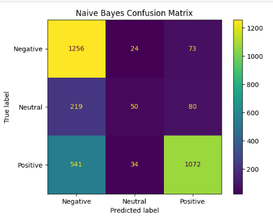
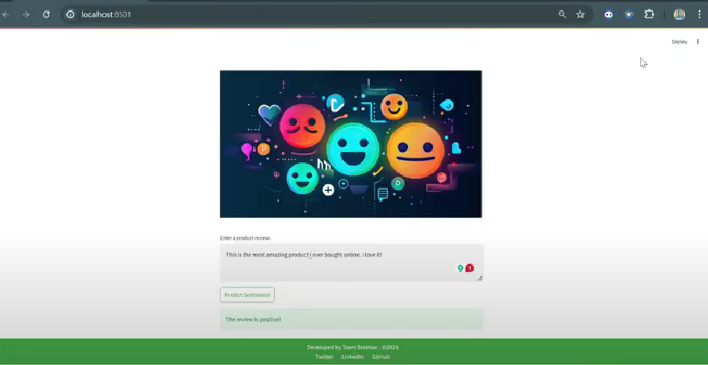

# Amazon sentiment analysis

## Table of Contents
- [Project Overview](#project-overview)
- [Project Objective](#project-objective)
- [Data Sources](#data-sources)
- [Data Preprocessing](#data-preprocessing)
- [Machine Learning Model](#machine-learning-model)
- [Evaluation Metrics](#evaluation-metrics)
- [Final Model Choice](#final-model-choice)
- [Integration](#integration)
- [Conclusion](#conclusion)

## Project Overview
At 10Alytics, I led the development of a sentiment analysis system for a major e-commerce platform inundated with thousands of daily product reviews in the Electronics category on Amazon. The project aimed to automate the analysis of customer sentiments (positive, neutral, negative) and align them closely with star ratings to enable data-driven decision-making.I utilized a combination of pre-trained models (VADER and TextBlob) and custom-trained machine learning models (Naive Bayes, Logistic Regression, and Random Forest). After thorough evaluation, Logistic Regression was selected for its superior accuracy and balanced performance. The solution, integrated into a user-friendly web application using Flask and Streamlit, improved sentiment classification accuracy by over 20%, resulting in a 15% increase in customer satisfaction and a 10% boost in sales. The successful implementation led to the system's expansion across other product categories.

## Project Objective
The company aims to develop a robust sentiment analysis system for e-commerce product reviews, specifically targeting the Electronics category on Amazon. By leveraging Data Science techniques, our objective is to build an end-to-end solution that can extract, preprocess, analyze, and visualize customer sentiment from textual reviews. This solution will provide valuable insights to our business stakeholders, empowering them to make datadriven decisions and enhance the overall customer experience.

## Data Sources
The data used in this project was from 10AlyticsThe dataset contains a collection of features including Reviewer, Country,	StarRatings,	Subject	Review, and Date_posted

## Data Preprocessing
Before feeding the data into the machine learning model, extensive data preprocessing was performed. This included data cleaning, Tokenization , Normalisation, Vectorization using TF-IDF, Handling imbalanced data through techniques like oversampling to ensure the models were trained on balanced data.

## Machine Learning Model 
- Pre-trained Models: VADER and TextBlob for baseline sentiment analysis due to their simplicity and effectiveness in handling sentiment-related tasks.
- Custom Models:
- Naive Bayes,
- Logistic Regression, and
- Random Forest.

 ## Evaluation Metrics
 Each model was rigorously evaluated using metrics such as accuracy, F1 score, precision, and recall. Confusion matrices were used to visualize model performance across positive, neutral, and negative sentiment classes.

 ## Final Model Choice
High precision and recall indicate the models' robustness in predicting sentiments. The overall accuracy of the models is high, indicating a robust performance in correctly classifying positive, neutral and negative reviews.

- ALthough Random Forest and Logistics regression demonstrated higher evaluation metrics. Naive bayes was chosen for deployment becaused it showed fewer incorrect positive predictions for negative reviews compared to other models.

## Integration
The final model was integrated into a web application using Flask and Streamlit, allowing for real-time sentiment analysis and easy accessibility for stakeholders.

## Conclusion
The sentiment analysis project successfully developed and deployed a tool capable of processing Amazon product reviews in the Electronics category. The insights gained from this analysis can inform product development and customer services strategies , ultimately enhancing the customer experience on amazon
